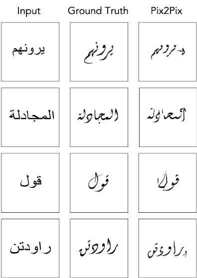
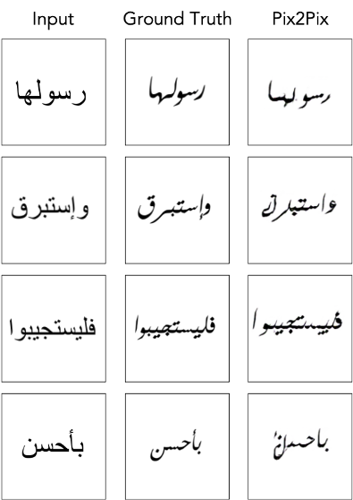
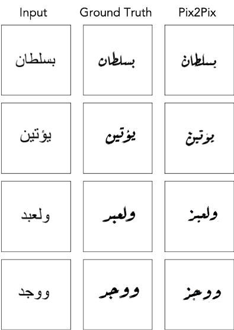
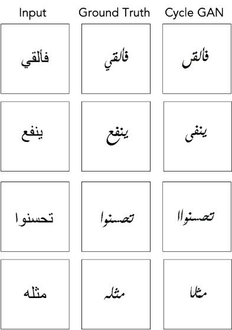
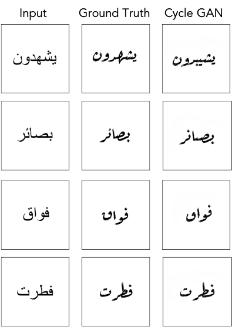

# Arabic Calligraphy Generation Through Image-to-Image Translation Using Generative Adversarial Networks (GANs)
This repository contains the code and resources for the paper: **Arabic Calligraphy Generation Through Image-to-Image Translation Using Generative Adversarial Networks (GANs)**.

Arabic calligraphy is a revered art form in the Arab world that has seen limited exploration in automated generation due to its complex nature and aesthetic principles and rules. However, recent advancements in deep learning provide promising avenues to address this challenge. In this work, we investigate the automatic generation of Arabic Calligraphy through image-to-image translation. Our approach utilizes Generative Adversarial Networks (GANs), a highly effective class of deep learning models recognized for their exceptional data generation abilities, to convert source font images (such as Arial) into desired calligraphy styles. Additionally, we propose a dataset comprising aligned images of conventional font and corresponding calligraphy styles (Reqaa, Diwani, and Farsi). We evaluate the quality of the generated images on the proposed dataset. Our experiments yield promising results, demonstrating significant progress in the automatic generation of Arabic calligraphy images.

## Generated Outputs
Below are some sample outputs generated by the models applied to Arabic calligraphy styles.

### Comparison of Pix2Pix and CycleGAN Outputs
<p float="left">
  
  
   
   
   
</p>


## Paper Citation
If you use this repository or our paper in your work, please consider citing us as follows:

```
@inproceedings{azzem2023arabic,
  title={Arabic Calligraphy Generation Through Image-to-Image Translation Using Generative Adversarial Networks (GANs)},
  author={HADJ AZZEM, Yousra Chahinez and Moussaoui, Abdelouahab and Berrimi, Mohamed},
  booktitle={2023 2nd International Engineering Conference on Electrical, Energy, and Artificial Intelligence (EICEEAI)},
  pages={1--6},
  year={2023},
  organization={IEEE},
  doi={10.1109/EICEEAI.2023.10590292}
}
```

